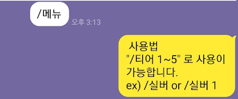
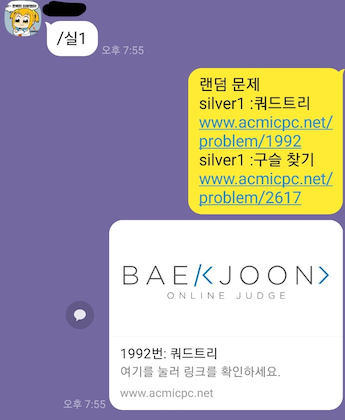

# 백준 자동응답 봇
---
> 백준 문제를 랜덤으로 추출하여 전송하는 API입니다.

## 구성
* 서버 : SpringBoot + JPA
* DB : H2

## 목적
1. 카톡을 통한 백준 문제 링크 전송.
2. 등급, 래밸 별 문제 구분하여 전송.

## 구현 목표
1. 백준 홈페이지 문제, 레벨 데이터 수집.
2. 등급별 구분, 래밸별 구분.

## 추가 목표
* 분류별 구분.
* 카톡방 공지사항 고정하기 (카카오톡 API 공부 필요)
* 백준 등급 주기적 업데이트 (배치 이용)

## 배포 구성

* GCP + Jenkins 를 이용한 배포. (현재 GCP 인스턴스 기간 만료로 사용이 중지됨.)
* Docker 를 이용한 배포로 구성 변경 예정

## 실행 예시

* 메뉴

  

* 사용 예시1

  

* 사용 예시 2

  
